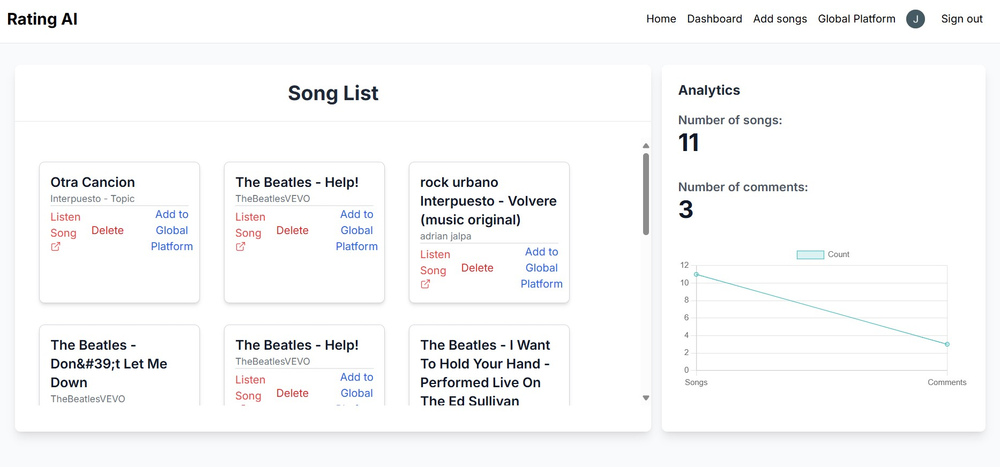
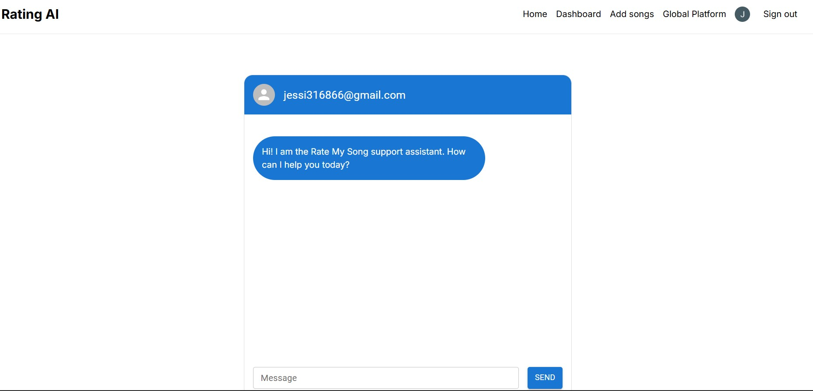
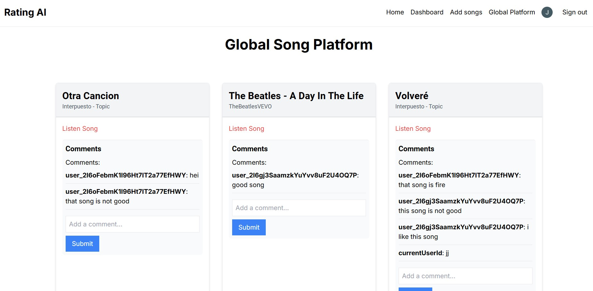

# Music Dashboard App

## Overview

Rate my song along with a music dashboard app built with Next.js, Firebase, Clerk, Pinecone, OpenAI, Node.js, and Youtube API. This app allows users to log in, track their favorite songs, and interact with a chatbot AI to discover songs from their favorite artists by using Youtube API. Users can upload these songs to a global platform, where they can browse, listen, and comment on songs shared by others. 

## Features

- **User Authentication:** Secure login and account management powered by Clerk.
- **Personal Dashboard:** Users can upload songs from its personal dashboard to the global platform and keep track of the number of comments made on the global platform. 
- **Chatbot AI Integration:** Users can find new songs from their artists with the support of AI and Pinecone, which suggests songs on their based input.
- **Song Management:** Songs generated via chatbot are automatically added to the user's dashboard
- **Global Platform:** Users can upload the dashboard songs to a global platform, which makes accessible to all users for listening and commenting 
- **Comments System:** Users can leave comments on any song within the global platform


## Tech Stack

- **Frontend:** Next.js, Tailwind, @mui/icons
- **Backend:** Node.js
- **Authentication:** Clerk
- **Database & Storage:** Firebase
- **AI & Natural Language Processing:** OpenAI API (chatbot) & Pinecone


## Getting started

### Prerequisites

Ensure you have installed the following tools on your development machine:

- Node.js (v16.x or later)
- npm
- Firebase CLI
- Clerk CLI
- Next.js

### Installation

1. **Clone the repository:**

```bash
git clone https://github.com/JessiP23/songs-rag.git
cd songs-rag
```

2. **Install dependencies:**

```bash
npm install
```

3. **Set up environment variables:**

Create a `.env.local` file in the root of your project and add the following environment variables:

```bash
OPENAI_API_KEY=
PINECONE_API_KEY=
YOUTUBE_API_KEY=
NEXT_PUBLIC_CLERK_PUBLISHABLE_KEY=
CLERK_SECRET_KEY=
```

**Set up Firebase:**
- Initialize firebase in your project:

```bash
firebase init
```

- configure your Firebase Firestore for data management

- Create a new file called firebaseConfig.js

```bash
// Import the functions you need from the SDKs you need
import { initializeApp } from "firebase/app";
import { getAnalytics } from "firebase/analytics";
import {collection, getFirestore, addDoc, getDocs} from 'firebase/firestore';


// Your web app's Firebase configuration
// For Firebase JS SDK v7.20.0 and later, measurementId is optional
const firebaseConfig = {
  apiKey: "",
  authDomain: "",
  projectId: "",
  storageBucket: "",
  messagingSenderId: "",
  appId: "",
  measurementId: ""
};


// Initialize Firebase
const app = initializeApp(firebaseConfig);
const db = getFirestore(app);

export {db, collection, addDoc, getDocs}

```


5. **Set up Clerk:**
 
- Configure Clerk authentication in your app by following the [Clerk Documentation](https://docs.clerk.dev/)

6. **Start the development server:**

```bash
npm run dev
```

Open your browser and navigate to `http://localhost:3000`

### Deployment

To deploy your application, you can use platforms like Vercel or Firebase Hosting.

## Usage

1. **User Authentication:**
- Users must sign up or log in to access their dashboard

2. **Dashboard:**
- After logging in, users will see their personal dashboard, displaying their tracked songs and comments.

3. **AI chatbot:**
- Users can interact with the AI chatbot to create or discover new songs. The AI will suggest songs, which can then be added to the user's dashboard.

4. **Global platform:**
- Users can choose to upload their songs to a global paltform. Once uploaded, these songs are visible to all users, who can listen and leave comments.

## Contributing
Contributions are welcome! If you'd like to contribute, please fork the repository and use a feature branch. Pull requests are warmly welcome.

## License
This project is licensed under the MIT License.

## Acknowledgements

- [Next.js](https://nextjs.org/)
- [Firebase](https://firebase.google.com/)
- [Clerk](https://clerk.dev/)
- [Pinecone](https://www.pinecone.io/)
- [OpenAI](https://openai.com/)
- [YouTube API](https://developers.google.com/youtube)


## Final Product



